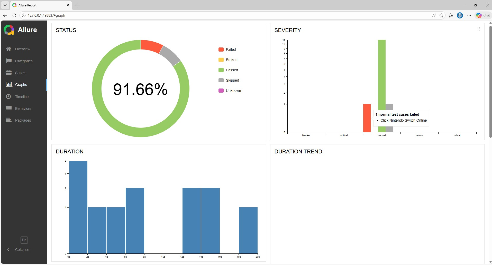
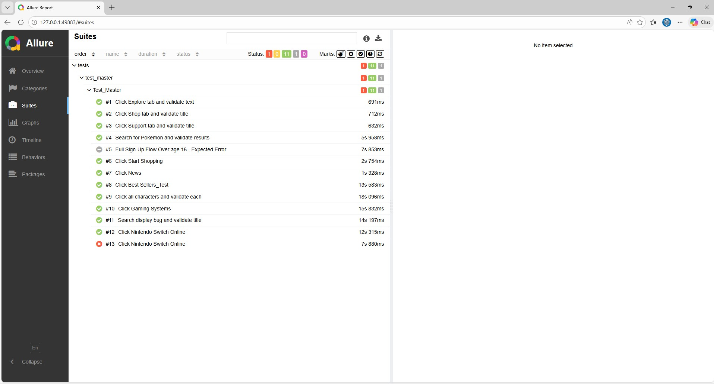

# 🎮 Nintendo Website Automated Testing with Playwright (Python)

This project is a complete UI automation test suite for the official [Nintendo US website](https://www.nintendo.com/us/), built using **Playwright** in **Python**.
It follows the **Page Object Model (POM)** design pattern for better scalability and maintainability.

---

## 🧪 Project Overview

* ✅ Automated functional tests for navigation, filters, and forms
* 🌐 Covers multiple site areas: **Explore**, **Shop**, **Characters**, and **Support**
* 🔐 Includes sign-up flow tests with validation
* 💥 Stress and regression tests
* 📸 Highlighting UI elements during interaction
* 🚀 Pytest + Allure for rich reporting

---

## 📁 Project Structure

```
NintendoProject/
├── pages/
│   ├── base_page.py
│   ├── home_page.py
│   ├── explore.py
│   ├── characters.py
│   ├── shop.py
│   ├── shop_games.py
│   ├── shop_store_exclusives.py
│   └── sign_up.py
│
├── tests/
│   ├── base_test.py
│   ├── test_all.py
│   ├── test_home_page.py
│   ├── test_explore.py
│   ├── test_shop.py
│   ├── test_characters.py
│   ├── test_sign_up.py
│   ├── test_bdika.py
│   └── conftest.py
│
├── .venv/                # Virtual environment
├── requirements.txt      # Dependencies
└── README.md
```

---

## 🛠️ Technologies Used

* **Playwright (Python)**
* **Pytest**
* **Allure** – test reporting
* **Page Object Model (POM)** structure
* **Python 3.10+**
* **GitHub Actions** – CI test execution

---

## 🚀 How to Run

1. 📦 Install dependencies:

   ```bash
   pip install -r requirements.txt
   ```

2. ▶️ Run tests with pytest:

   ```bash
   pytest tests/
   ```

3. 📊 (Optional) Generate Allure Report:

   ```bash
   pytest --alluredir=allure-results
   allure serve allure-results
   ```

---

## 🤖 Run Tests with GitHub Actions

This project supports running the automated test suite directly through **GitHub Actions**, so anyone reviewing the repository can execute the tests without installing anything locally.

### ▶️ How to run the tests from GitHub

1. Open the repository on GitHub
2. Go to the **Actions** tab
3. 3. Select **Run Nintendo Tests**
4. Click **Run workflow**
5. Choose the branch you want to run
6. Click **Run workflow** again to start execution

GitHub will automatically create a clean environment, install the dependencies, install Playwright browsers, and run the test suite.

### ⚙️ What the workflow does

The workflow typically performs these steps:

* Checks out the repository
* Installs Python
* Installs dependencies from `requirements.txt`
* Installs Playwright browsers
* Runs the tests with `pytest`
* Generates results and logs
* Uploads artifacts such as reports, screenshots, and videos

### 📊 View the results

After the workflow finishes:

1. Open the workflow run
2. Review the logs for each step
3. Download uploaded artifacts such as:

   * Test reports
   * Screenshots
   * Videos
   * Allure results

### 💡 Why this is useful

* No local setup is required
* Makes the project easier to review and validate
* Demonstrates CI/CD and test automation skills
* Allows anyone to run the suite directly from GitHub

---

## 💡 Highlights

* Smart element interaction using custom `BasePage` with:

  * `highlight()` method for UI debugging
  * Safe `wait_for()` and error handling
* SlowMo & debugging options available
* Rich test coverage across:

  * Navigation
  * Category browsing
  * Form validation
  * Sign-up errors and flow logic

---

## 📸 Reports



---

## 📄 License

MIT License © 2025 Nadav Sagie
